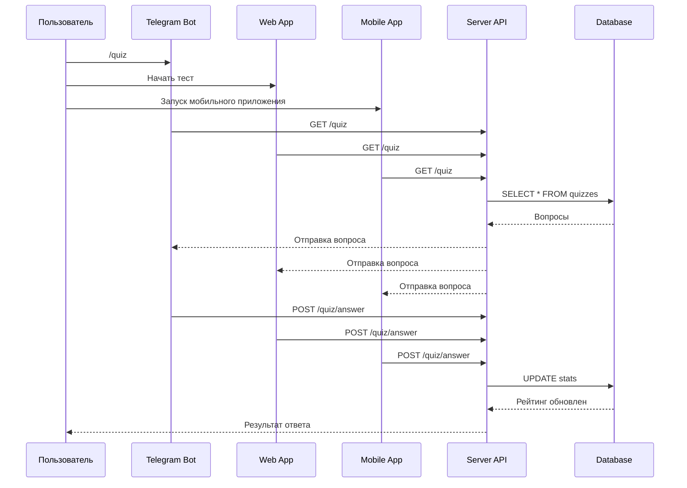

# 📌 QuizBot Platform Architecture

Добро пожаловать в документацию проекта **QuizBot**.  
Этот шаблон поможет управлять архитектурой, API и логикой приложения.

---

## 🔹 Общая архитектура

```mermaid
flowchart TB
    subgraph FRONTEND [Фронтенды]
        TG[🤖 Telegram Bot] --> API
        WEB[💻 Web App (React + TS)] --> API
        MOB[📱 Mobile App (Flutter/React Native)] --> API
    end

    subgraph BACKEND [Серверная часть]
        API[🔗 REST / GraphQL API]
        SCHEDULER[⏳ Scheduler: рассылки, статистика]
    end

    subgraph DB [База данных]
        USERS[(👤 Users)]
        QUIZZES[(❓ Quizzes)]
        RATINGS[(🏆 Ratings)]
        STATS[(📊 Stats)]
    end

    API --> USERS
    API --> QUIZZES
    API --> RATINGS
    API --> STATS
    SCHEDULER --> STATS
```

---

## 🔹 Модули проекта

### **1. Telegram Bot**
- Команды: `/start`, `/quiz`, `/rating`, `/set_lang`
- Логика викторин и выдачи вопросов
- Интеграция с API

---

### **2. Web App**
- Фреймворк: React + TypeScript
- UI: выбор тестов, отображение рейтинга
- Работает через REST API

---

### **3. Mobile App**
*(запланировано)*
- Кроссплатформенный (Flutter / React Native)
- Интеграция с тем же API

---

### **4. Server & API**
- REST / GraphQL API
- Авторизация пользователей
- Выдача рейтингов и статистики
- Планировщик:
    - Рассылки
    - Ежедневная статистика

---

### **5. Database**
**Таблицы:**  
- **users** → `id`, `username`, `language`, `score`
- **quizzes** → `id`, `question`, `answers[]`, `correct`
- **ratings** → `user_id`, `score`
- **stats** → `user_id`, `completed_quizzes`, `daily_usage`

---

## 🔹 API Endpoints

| Метод | Endpoint          | Описание                 |
|-------|------------------|--------------------------|
| GET   | /api/quiz        | Получение случайного вопроса |
| POST  | /api/quiz/answer | Проверка ответа           |
| GET   | /api/rating      | Получение рейтинга        |
| GET   | /api/stats       | Статистика пользователя   |

Пример запроса:
```bash
GET /api/quiz
Content-Type: application/json
```

Ответ:
```json
{
  "id": 123,
  "question": "Столица Индии?",
  "options": ["Дели", "Мумбаи", "Бангалор"],
  "correct": 0
}
```

---

## 🔹 Data Flow



---

## 🔹 TODO / Roadmap

- [x] Telegram Bot MVP
- [x] Web App MVP
- [ ] Mobile App
- [ ] Расширение API
- [ ] Аналитика и статистика
